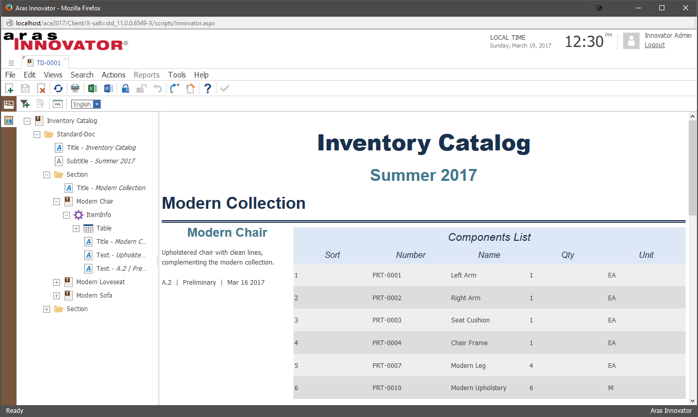

# CustomTechDocs

Demonstrates how to create a custom content generator for Tech Doc schema elements.

## How It Works

The project's import package adds a collection of examples showcasing how you can customize the look and functionality of a Tech-Doc.

The first example includes a new content generator method for the ItemInfo schema element, replacing the out-of-the-box implementation. The new content generator method, `labs_ItemInfoContentGenerator`, populates every new ItemInfo element with the name, description, cost, major revision/generation, state, and created date for the selected assembly (Part item). The method also adds the assembly's BOM in a tabular layout.

The second example has a new schema which allows you to modify the size of graphics you add to your Tech-Doc. There are two different schemas. One allows you to set predefined widths for your graphics, and one allows you to insert any styling you'd like on your graphic. Both of these changes can be made by editing the attributes for a graphic included in your Tech-Doc. These changes don't require a new content generator, just modifications to the schema and stylesheet.

The third example allows you to create a table which contains dynamically generated links for each row of the table. The example uses the part ItemType and a single entry, but the code could easily be modified to work for other ItemTypes as well. The content generator method `labs_PartLinkGenerator`, shows how you can modify the attributes of a TextDocumentElement to add an external hyperlink dynamically within a table cell. 

This project also includes the ability to create a template for future Tech-Docs. This is incredibly handy if you need multiple documents which follow a specific format. The instructions on how to use templates can be found below. 

## History

This project and the following release notes have been migrated from the old Aras Projects page.

Release | Notes
--------|--------
[V1.3](https://github.com/ArasLabs/custom-tech-docs/releases/tag/v1.3) | Added more examples and updated for SP15
[v1.2](https://github.com/ArasLabs/custom-tech-docs/releases/tag/v1.2) | Adds template functionality.
[v1.1](https://github.com/ArasLabs/custom-tech-docs/releases/tag/v1.1) | Fixes an import error.
[v1.0](https://github.com/ArasLabs/custom-tech-docs/releases/tag/v1.0) | First release. Though built and tested using Aras 11.0 SP9, this project may function in older releases of Aras 11.0.

#### Supported Aras Versions

Project | Aras
--------|------
[v1.3](https://github.com/ArasLabs/custom-tech-docs/releases/tag/v1.3) | 11.0 SP15
[v1.2](https://github.com/ArasLabs/custom-tech-docs/releases/tag/v1.2) | 11.0 SP9
[v1.1](https://github.com/ArasLabs/custom-tech-docs/releases/tag/v1.1) | 11.0 SP9
[v1.0](https://github.com/ArasLabs/custom-tech-docs/releases/tag/v1.0) | 11.0 SP9

## Installation

#### Important!
**Always back up your code tree and database before applying an import package or code tree patch!**

### Pre-requisites

1. Aras Innovator installed (version 11.0 SPx preferred)
2. Aras Technical Documentation is installed
3. Aras Package Import tool
4. CustomTechDocs import package

### Install Steps

**The Aras Update package for Tech-Docs is not supported in SP15**
1. Backup your database and store the BAK file in a safe place.
2. Open up the Aras Package Import tool.
3. Enter your login credentials and click **Login**
    * _Note: You must login as root for the package import to succeed!_
4. Enter the package name in the TargetRelease field.
    * Optional: Enter a description in the Description field.
5. Enter the path to your local `..\CustomTechDocs\Import\imports.mf` file in the Manifest File field.
6. Select the following in the Available for Import field.
    * **aras.labs.CustomTechDocs**
    * **com.aras.innovator.solution.TechDoc**
    * **com.aras.innovator.tdf**
    * **com.aras.innovator.solution.PLM**
7. Select Type = **Merge** and Mode = **Thorough Mode**.
8. Click **Import** in the top left corner.
9. Close the Aras Package Import tool.

You are now ready to login to Aras and try out the CustomTechDocs project.

## Usage

### Customized Item-Info Element

**Pre-requisite:** The Aras instance should include some Parts with BOM relationships.

1. Log in to Aras as admin.
2. Navigate to **Technical Documentation > Technical Documents**.
3. Create a new Technical Document with the `Standard` schema.
4. Add an ItemInfo element to the document, selecting a Part with Part BOM relationships when the search dialog appears.
5. Save the document.

### Tech Doc Templates

1. Log in to Aras as admin.
2. Navigate to **Technical Documentation > Technical Documents**.
3. Create a new Technical Document with the `Standard` schema.
4. Check off the **Is Template** field on the Tech Doc form.
5. Save the document.
6. Add some content to the template document.
7. Save, unlock and close the document.
8. In the main grid, right click the new template document and select **Create New From Template**.

The new document will open in a new tab. The content will be populated based on the selected template.

### Custom Graphic Sizing
1. Log into Aras as Admin.
2. Navigate to **Technical Doucmentation > Technical Documents**.
3. Create a new Technical Document with `Image Size Example` schema.
4. Add a graphic to the document.
5. Right-click the graphic element, and select **Edit Attributes**
6. Type **Width: 100px** and save the attributes. You can add any CSS Styling to the image here.

### Table With Links
**Pre-requisite:** The Aras instance shoudl include multiple Parts.
1. Log into Aras as Admin.
2. Navigate to **Technical Doucmentation > Technical Documents**.
3. Create a new Technical Document with `linkExample` schema.
4. Add a `PartLink` item to the document.
5. Select a part to reference within the table.
6. Highlight the cell with the hyperlink
7. Press the `Test Link` buton which appears in the toolbar.

## Contributing

1. Fork it!
2. Create your feature branch: `git checkout -b my-new-feature`
3. Commit your changes: `git commit -am 'Add some feature'`
4. Push to the branch: `git push origin my-new-feature`
5. Submit a pull request

For more information on contributing to this project, another Aras Labs project, or any Aras Community project, shoot us an email at araslabs@aras.com.

## Credits

Created by Eli Donahue for Aras Labs. @EliJDonahue

## License

Aras Labs projects are published to Github under the MIT license. See the [LICENSE file](./LICENSE.md) for license rights and limitations.
